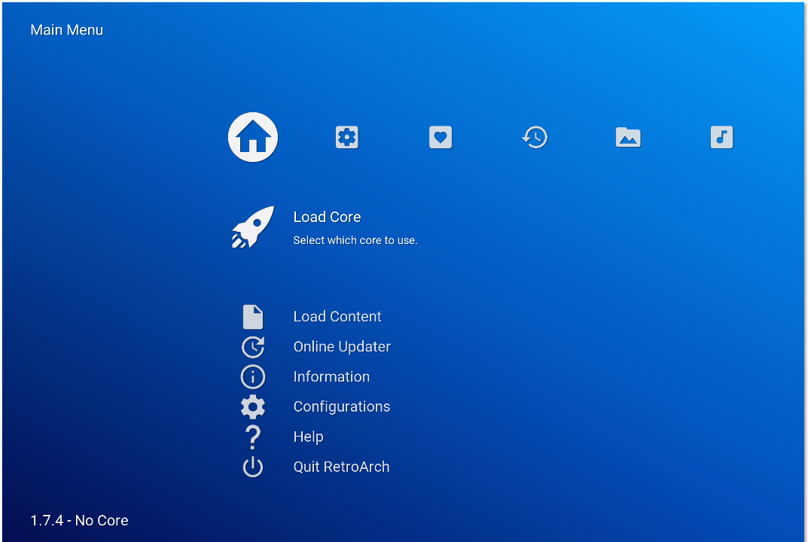

# Material Design RetroArch Theme

[Material Design](https://material.io/) is a unified system that combines theory, resources, and tools for crafting digital experiences. This is a [RetroArch](http://libretro.com/) theme which aims to adopt those principles.



## Features

- [Material Design Icons](https://materialdesignicons.com/)
- [Roboto Font](https://fonts.google.com/specimen/Roboto)
- [Material Design Background](http://more-sky.com/WDF-138466.html)

## Install

1. [Download the theme](https://github.com/RobLoach/retroarch-theme-materialdesign/archive/master.zip)
2. Place the files in the `assets/xmb/custom` folder
3. In the menu, select the *Custom* theme
4. Quit and re-launch RetroArch

### Build

1. Install requirements

  - PHP >= 5.6
  - Node.js > 4
  - [Composer](https://getcomposer.org)

2. Install dependencies
  ```
  composer install
  npm install
  ```

3. Build the theme
  ```
  composer test
  ```

## Licenses

- Roboto Font: [Apache License 2.0](https://www.apache.org/licenses/LICENSE-2.0)
- Material Design Community Icons: [SIL Open Font License 1.1](http://scripts.sil.org/cms/scripts/page.php?item_id=OFL_web)
- Google Material Design Icons: [Attribution 4.0 International](https://github.com/google/material-design-icons/blob/master/LICENSE)
- RetroArch Material Design Source: [MIT](LICENSE.md)
